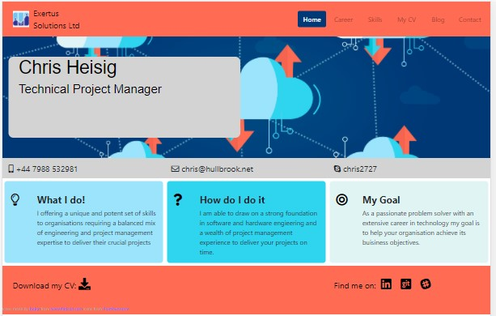
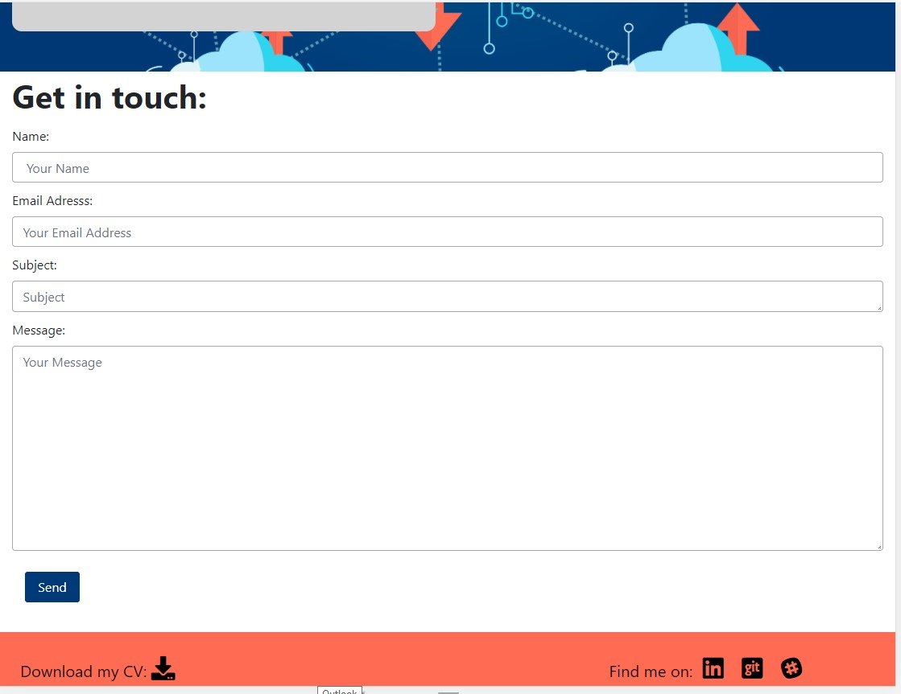
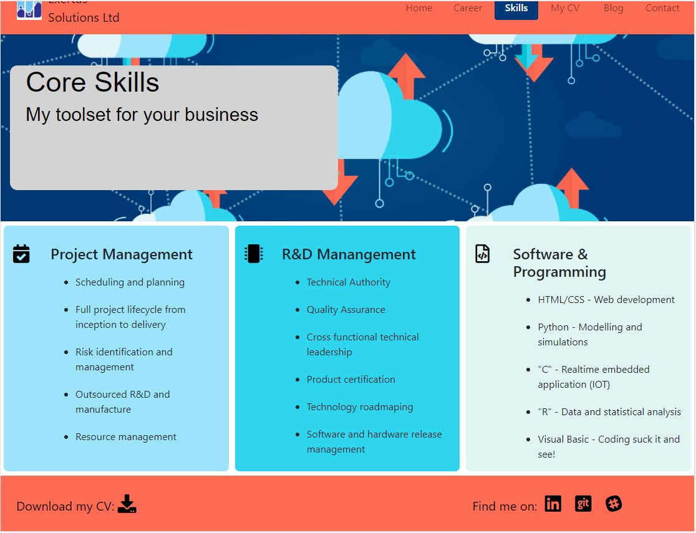
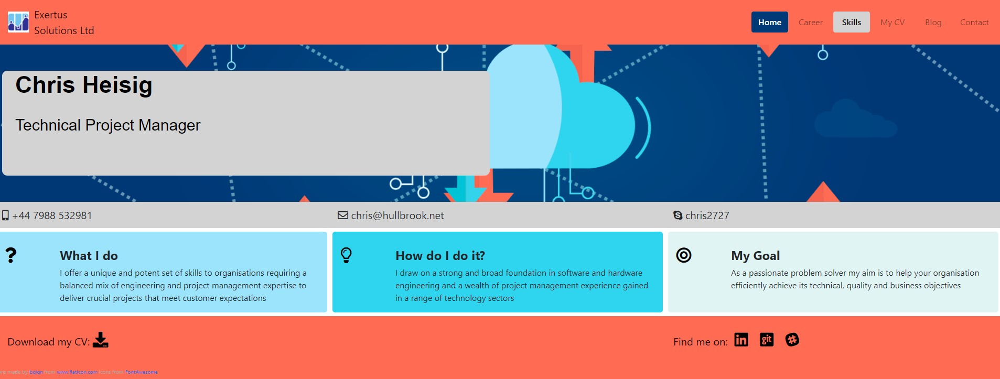

# Milestone Project 1 - Personal Profile

## 0. Contents

1.  [Introduction](#introduction)
2.  [Business Requirements & Use Cases](#usecases)
3.  

- Business Requirements & Use Cases **2.**

- User Experience 3.

- Test 4.

- 5.0 Deployment

- 6.0 Update and Maintenance

- 7.0 Defect/Resolution Log

- 8.0 Design Constraints

- 9.0 Future Enhancements

- 10.0 Acknowledgements & Credits

- Annex 1 - Test Evidence

## 1.  Introduction 

This readme file contains the documentation associated with the first milestone submission for the Code Institute Diploma in Software Development. This project milestone submission will consist of a personal portfolio site for me. 

The goal of the website is not simply to re-tell the contents of my CV, but to provide an insight into my work experience and what I might be able to do for a client or potential employer.

## 2. Business Requirements & Use Cases 

- **Use case 1:** As a site user and a recruiter I want to know whether Chris Heisig is potentially the right candidate for my client.

- **Use case 2:** As a potential employer I want to determine if Chris Heisig has the appropriate mix of skills necessary for the role.

- **Use case 3:** As the site owner I want to present my work experience and my skills in the best possible light to get hired.

- **Use case 4:** As the site owner I want potential clients to learn what other skills and interests I have.

- **Use case 5:** As a visitor to the website, want to be able to read its contents clearly on devices with different screen widths.

## 3. User Experience
The website design will be meet the following requirements. 

### 3.1 Strategy

**3.1.1** To align with the Business Requirements and use cases.

### 3.2 Scope

**3.2.1** The web site will display information demonstrating my work skills and work history in a clear and consistent manner regardless of the device used to view it

**3.2.2** Pages will be structured to allow future updates to be made without the need to re-factor the HTML or CSS

### 3.3 Structure

**3.3.1** The web site will consist of 7 pages allowing information to be revealed in a structured format. 

    - The landing page

    - A skills page

    - A career history page

    - A page opening up to a pdf of my CV

    - A blog of my most recent projects

    - A contact page

    - A blog page

### 3.4 Skeleton

**3.4.1** A navigation bar will allow the visitor to easily access available pages.

**3.4.2** At small screen widths (320px) the navigation bar will collapse to an icon.

**3.4.3** Clicking in the collapsed icon will reveal the navigation bar vertically aligned.

**3.4.4** To aid visitor navigation, navigation bar items will highlight indicating the page being displayed.

**3.4.5** Hovering above a navigation bar item will result in that navigation bar item being highlighted.

**3.4.6** With the exception of the page leading to the CV, all pages will display the header and footer in the same position

**3.4.7** The user will always be able to navigate back to the home page

**3.4.8** Each page will include a common banner to uniquely identify the web site. 

**3.4.9** Clicking on icons located in either the header or footer will result in a successful hyperlink to the selected web site. 

### 3.5 Surface

**3.5.1** All pages will render to provide a readable display at 1206px, 768px and 320px.

**3.5.2** The design will use a limited pallet of colours (less than 7)

**3.5.3** Each page will be structured using the "rule of three" unless this makes the page unreadable. 

**3.5.4** If using the "rule of three" makes the page unreadable on a smaller screen, then in the first instance content will be stacked

**3.5.5** If hiding unnecessary images and icons continues to make pages unreadable at smaller screen widths, unnecessary images and icons will be hidden from the visitor.

## Development Approach
The development of the HTML and CSS code started with a design of each of the 6 pages (the  copy of my CV in pdf makes 7). 

## 4. Test

### 4.1 Test Approach

- Use available on line tools to confirm that the code (HTML & CSS) complies with industry standards

- Use available browser tool emulators to confirming that web pages render correctly on devices using different screen sizes

- View completed web pages on physical devices to confirm the results of the emulations.

- Exercise all hyperlinks to ensure that they land at the nominated.

### 4.2 Test Tools

- [**W3C Markup Validation Service**](https://validator.w3.org/)
- [**W3C HTML Validation Service**](https://validator.w3.org/)
- [**W3C CSS Validation Service**](http://www.css-validator.org/)
- Google Browser Developer Tools
- Physical devices featuring different screen sizes 

### 4.3 Use Case Test

Tests use cases identified in section 2

**Use case 1:** 

**Description:** Confirm that a recruiter can obtain sufficient background on Chris Heisig to know  that he is potentially the right candidate for his client.

**Method:** View landing page using Google Developer Tools

**Expected Outcome:** A recruiter is able to determine the right level of information.

**Tested Outcome:** 

The web landing page provides a concise summary of my primary role and skills {width=50%}

If the recruiter believes that he has a potential match for me, the web site permits him to get in contact and request further information.

{width=50%}

**Use case 2:** 

**Description:** Confirm that an empoyer can obtain sufficient background on Chris Heisig to know  that he is potentially suitable for the job.

**Method:** View the core skills and  career history pages using Google Developer Tools

**Expected Outcome:** A recruiter is able to determine the right level of information from my career history.

**Tested Outcome:** 

The website lists my core skills and career history.

{width=50%}

**Use case 3:**
 
***Description** I want to present my work experience and my skills in the best possible light to get hired.

**Method:** View the entire web site pages using Google Developer Tools.

**Expected Outcome:** A recruiter or potential employer is able to determine the right level of information from my web site.

**Tested Outcome** ?
 

**Use case 4:** 

**Description** Lead the web site visitor to read my blog.

**Method:** View my blog page using Google Developer Tools.

**Expected Outcome:** Visitors to my web site will be interested to see what I get up to.

**Tested Outcome:** 
My website includes a page dedicated to "things" that have a interest in and how I have pursued them: 

{width=25%}

**Use case 5:** 
 
**Description**  
 
**Method:** View the core skills page using Google Developer Tools

**Expected Outcome** The website contents is clearly readable on devices with different screen widths.
 
As the screen width is decreased, icons that may detract from the readability are hidden and the columns aligned into a single row while still retaining the underlying form and structure. 

{width=50%} {width=25%}    {width=15%}

*fig: Career page at 1206px,  Career page at 768px,  Career page at 320px*

The navigation bar colapses into an icon at the lowest screen width to save space for more content to be displayed.

{width=20%}

*fig: Collapsed nav bar at small screen width*

### 4.4 Non-functional Test

Confirms non-functional requirements.

#### Test Case 1 (non-functional)

**Description:** HTML code is compliant.

**Method:** Run all pages through the W3C validator.

**Expected Outcome:** No errors identified.

**Tested Outcome**  Pass -code errors and warning rectified and commited to Git.

#### Test Case 2 (non-functional)

**Description:** CSS code is compliant.

**Method:** Run all pages through the W3C validator.

**Expected Outcome:** No errors identified.

**Tested Outcome**  Three parse errors encountered which would suggest some hidden characters in the CSS file - not considered serious.

### 4.5 Functional Test

Confirms requirements set out in section 3

#### Test Case 3.4.1
 
**Description:** Use the navigation bar items to navigate between web pages.

**Method:** Inspect a page using the Google Browser Development Tools.

**Expected Outcome:** The user is able to navigate between pages using the navigation bar items.
 
**Tested Outcome:** 

{width=20%}  {width=50%}

*fig: showing navigation bar item selected*

#### Test Case 3.4.2

**Description:** Reduce the screen width to  320px and demonstrate that the navigation bar collapses to an icon.

**Method:** Inspect a page using the Google Browser Development Tools.

**Expected Outcome:** The user is able to navigate between pages using the navigation bar items when expanded on a 320px screen.
 
**Tested Outcome:** 

{width=20%}

*fig: showing navigation bar expanded from the icon*

#### Test Case 3.4.3 
**Description** Click on the collapsed icon at a screen width of 320px to reveal the navigation bar with items vertically aligned.

**Method:** Inspect a page using the Google Browser Development Tools.

**Expected Outcome:** For a 320px screen size the navigation bar is displayed vertically.
 
**Tested Outcome:** 

{width=20%}

*fig: showing navigation bar displayed vertically*

#### Test case 3.4.4 
**Description** Observe the navigation bar and confirm that an item responds to being selected.
 
**Method:** Inspect a page using the Google Browser Development Tools.

**Expected Outcome:** For any size screen, a navigation bar item will respond positively to being selected
 
**Tested Outcome:** 

{width=30%} {width=30%}

*fig: showing navigation bar response to selection*

#### Test Case 3.4.5 

**Description:**  Hover over a navigation bar item and  confirm that it responds.

**Method:** Inspect a page using the Google Browser Development Tools.

**Expected Outcome:** For any size screen, a navigation bar item will respond positively to being hovered over
 
**Tested Outcome:** 

{width=50%} {width=25%}

*fig: showing response to hovering over a navigation bar item*

#### Test Case 3.4.6

**Description:** Confirm that with the exception of the page leading to the CV, all pages will display the same header and footer.

**Method:** Inspect a page using the Google Browser Development Tools.

**Expected Outcome:** For any size screen, a navigation bar item will respond positively to being hovered over
 
**Tested Outcome:** 

{width=30%} {width=50%}

*fig: showing header and footer content and location*

#### Test Case 3.4.7

**Description:** Confirm that the user is able to navigate back to the home page.

**Method:** Inspect a page using the Google Browser Development Tools.

#### Test Case 3.4.8

**Description:** Confirm that with the exception of the page leading to the CV, all pages will display the same banner in the same position.

**Method:** Inspect a page using the Google Browser Development Tools.

#### Test Case 3.4.9

**Description:** Confirm that clicking on icons located in either the header or footer result in a successful hyperlink to the selected web site. 

**Method:** Inspect a page using the Google Browser Development Tools.

#### Test Case 3.5.1

**Description:** Confirm that all pages render correctly at screen sizes of 320px for phones, 768px for tablets, 1206px for desk tops. 

**Method:** Verify correct rendering using Google Browser Development Tools and setting the screen width to the appropriate number of pixels to emulate the given device.

**Expected Outcome:** For all pages, the  content is readable at the three screen widths.
 
**Tested Outcome:** 

{width=50%} {width=25%} {width=15%}

*fig: Index page at 1206px,*  *Index page at 768px,* *Index page at 320px*

**Test Case 3.5.2**

**Description:** Confirm that a  limited pallet of colours (less than 7) has been used.

**Method** Inspect the associated CSS file.

**Expected Outcome:** A pallet of less than 7 colours has been used

**Tested Outcome:** Pages use the colour pallet specified in the CSS file.

**Test Case 3.5.3**

**Description:** Confirm that the "rule of three has been used in the design of the "

**Method:** Inspect a page using the Google Browser Development Tools

**Expected Outcome:** The "rule of three" is being utilised.

**Tested Outcome** 

{width=50%}

*fig: Index page at 1206px,*

**Test Case 3.5.4**

**Description:** Confirm that content is stacked at a 768px screen size

**Method:** Inspect a page using the Google Browser Development Tools

**Expected Outcome:** Content is stacked when viewed at a screen size of768px.

**Tested Outcome** 

{width=30%}

*fig Career page at 768px*

#### Test Case 3.5.5

**Description:** Confirm that content is stacked at a 320px screen size and icons hidden

**Method:** Inspect a page using the Google Browser Development Tools

**Expected Outcome:** Content is stacked and icons hidden when viewed at a screen size of 320px.

**Tested Outcome** 

{width=15%}

*fig Career page at 320px*

**Description:** For 320px screens the Nav bar is rendered as a icon and exp.

**Method:** Verify that the Nav bar icon expands to reveal it's contents in a vertical list and that it is possible to navigate to another web page.

**Expected Outcome:** Nav bar icon expands out  to reveal it's contents in a vertical list and that it is possible to navigate to another web page.

**Tested Outcome:** 

 {width=16%} {width=15%}
 
 *fig Nav icon expands at a screen width of  320px*
 
 

|3|Confirm that all pages render correctly at screen sizes of 576px for phones, 786px for tablets, 992px for desk tops and 1200px for large screens  | Verify correct rendering using Google Browser Development Tools |For small screen the Nav bar is rendered as a "burger icon"|Pass - refer to test evidence in section 4.4
|4|Navigation to all pages is possible via the navigation bar.|Check the navigation for each page|The user is able to navigate to every page|Pass - navigation is possible via both the extended nav bar and the compressed nav bar see evidence below |

### 5.0 Initial Deployment

This milestone project was deployed at [**Milestone project 1**](https://chrish2727.github.io/Milestone-1/) using Github Pages. 

The associated Github repository can be found at [**Milestone-1**](https://github.com/ChrisH2727/Milestone-1)

### 6.0 Update and Maintenance

The HTML code associated with each of the web pages is identically structured, with a header, footer, a section containing a central banner and one or more other sections that have a different content depending on the information that it is intended to impart.   

{width=80%}

*fig: HTML Code Structure*

Note, that external hyperlinks are at the bottom of the script so that they load last awwoling the main body of the page to render.

### 7.0 Defect/Resolution Log

|Date|Defect Description|Solution|Notes|
|---|---|---|---|
|17-Feb-21|Although basic structure developed, styling outstanding|2-Mar-21 - styling improved |stop when good enough! |
|21-Feb-21|At lower screen sizes when the Nav Bar collapses into the burger ok,  the Nav items are however not displayed| Fixed 27-Feb-21 nav-bar-collapse implemented correctly |
|21-Feb-21|Pages are not responsive to lower screen widths|Fixed 28-Feb-21|Unecessary icons and images also hidden at lower screen widths|
|20-Feb-21|Nav bar pills remain the standard blue when activated rather than changing to the selected colour|Fixed 28-Feb-21 default styling overwritten ||
|26-Feb-20|Message submit button does not hyperlink correctly|Fixed 26-Feb-21 Clicking on the submit button causes a hyperlink to acknowledgement page from where the user can return to the main web site|Note, that a normal response would be an email fired of to a nominated address|
|1-Mar-21|Column widths too narrow when viewed on a 768px screen|1-Mar-21 Fixed, content now displayed in rows at 768px   |   |
|1-Mar-21|Company icon (top left of the image) fails to hyperlink correctly|1-Mar-21 Fixed, no hyperlinks to an external web page|The external webpage is still under construction but deemed outside of the submission|
|2-Mar-21|Inconsistent colour pallet used across web pages| Fixed  | The banner that is common to all pages was scanned with an on-line colour picker and the primary colours identified used as background|

### 8.0 Design Constraints

- The web pages associated with the URL [www.exertus-solutions.co.k](www.exertus-solutions.co.uk). There is a hyperlink to www.exertus-solutions.co.uk at the top right of the header. While this hyperlink functions correctly, the associated web site is still under development.  

- Emails sent from the contacts page do not reach a nominated email address and the response message is a dummy.

### 9.0 Future Enhancements

A further attention could be paid to enhancing the styling and in particular the font type, sizes and weights

The blog web page could be enhanced so that the text wraps arround the images at lower screen widths.

### 10.0 Acknowledgements & Credits

- Extensive use was made of the html CCS and bootstrap code  referenced in the **training material for this course**.

- John Duckett's reference book **HTML & CSS design and build websites**  provided an invaluable source of basic information.

- **Bootstrap** online documentaion provided useful references.

### Annex 1 Test Evidence

{width=40%}
*Index page at 1206px*

{width=40%}
*Index page at 768px*

{width=40%}
*Index page at 320px*

*Career page at 1206px*

*Career page at 768px*

*Career page at 320px*

*Contact page at 1206px*

*Contact page at 768px*

*Contact page at 320px*

*Message response*

*Icon font weight change*

*Navigation via the collapsed nav bar at small screen width*

### 5.0 Defect/Resolution Log

|Date|Defect Description|Solution|Notes|
|---|---|---|---|
|17-Feb-21|Although basic structure developed, styling outstanding|2-Mar-21 - styling improved |stop when good enough! |
|21-Feb-21|At lower screen sizes when the Nav Bar collapses into the burger ok,  the Nav items are however not displayed| Fixed 27-Feb-21 nav-bar-collapse implemented correctly |
|21-Feb-21|Pages are not responsive to lower screen widths|Fixed 28-Feb-21|Unecessary icons and images also hidden at lower screen widths|
|20-Feb-21|Nav bar pills remain the standard blue when activated rather than changing to the selected colour|Fixed 28-Feb-21 default styling overwritten ||
|26-Feb-20|Message submit button does not hyperlink correctly|Fixed 26-Feb-21 Clicking on the submit button causes a hyperlink to acknowledgement page from where the user can return to the main web site|Note, that a normal response would be an email fired of to a nominated address|
|1-Mar-21|Column widths too narrow when viewed on a 768px screen|1-Mar-21 Fixed, content now displayed in rows at 768px   |   |
|1-Mar-21|Company icon (top left of the image) fails to hyperlink correctly|1-Mar-21 Fixed, no hyperlinks to an external web page|The external webpage is still under construction but deemed outside of the submission|

### 6.0 Design Constraints

- The web pages associated with the URL [www.exertus-solutions.co.k](www.exertus-solutions.co.uk). There is a hyperlink to www.exertus-solutions.co.uk at the top right of the header.

- Emails sent from the contacts page do not reach a nominated email address and the response message is a dummy.

### Future Enhancements

A further page could be added to highlight some of the interesting projects that I have undertaken. These projects demonstrate my passion for IOT and how this technology may be harnessed to monitor our environment for polution at a macro level. It also demonstrates my skills as a hardware engineer, and a developer of software for micro-controller applications, epecially if the micro-controller is a low-cost and high performance device as may be found in billions of domestic products. 

### 7.0 Acknowledgements

- Extensive use was made of the html CCS and bootstrap code  referenced in the **training material for this course**.

- John Duckett's reference book **HTML & CSS design and build websites**  provided an invaluable source of basic information.

- **Bootstrap** online documentaion provided useful references.

