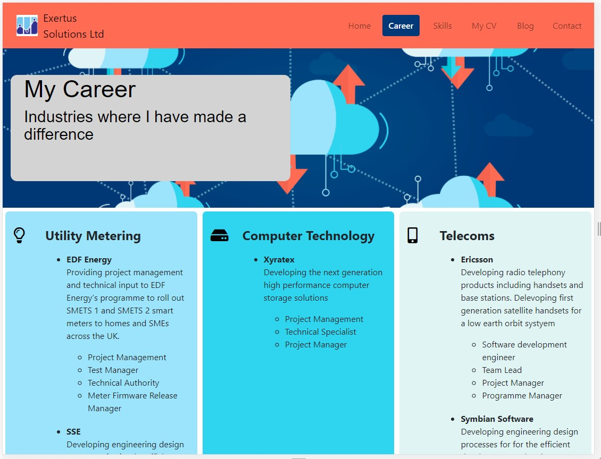

# Milestone Project 1 - Personal Profile

## 0. Contents

- Introduction  **1.**

- Business Requirements & Use Cases **2.**

- User Experience 3.

- Test 4.

- 5.0 Deployment

- 6.0 Update and Maintenance

- 7.0 Defect/Resolution Log

- 8.0 Design Constraints

- 9.0 Future Enhancements

- 10.0 Acknowledgements & Credits

- Annex 1 - Test Evidence

## 1. Introduction

This readme file contains the documentation associated with the first milestone submission for the Code Institute Diploma in Software Development. This project milestone submission will consist of a personal portfolio site for me. 

The goal of the website is not simply to re-tell the contents of my CV, but to provide an insight into my work experince and what I might be able to do for a client or potential employer.

## 2. Business Requirements & Use Cases

- **Use case 1:** As a site user and a recruiter I want to know whether Chris Heisig is potentially the right candidate for my client.

- **Use case 2:** As a potential employer I want to determine if Chris Heisig has the appropriate mix of skills necessary for the role.

- **Use case 3:** As the site owner I want to present my work experience and my skills in the best possible light to get hired.

- **Use case 4:** As the site owner I want potential clients to learn what other skills and interests I have.

## 3. User Experience

### 3.1 Strategy

To align with the Business Requirements and use cases

### 3.2 Scope

The web site will display information regrding my work skills and work history in a clear and consistent manner regardless of the device used to view it

Pages will be stuctured to allow future updates to be made without the need to re-factor the HTML or CSS

### 3.3 Structure

- The web site will consist of 7 pages allowing information to be revield in a stuctured maner:

    - The landing page

    - A skills page

    - A career history page

    - A page opening up to a pdf of my CV

    - A blog of my most recent projects

    - A contact page

    - A portfolio page

### 3.4 Skeleton

- A navigation bar will allow the visitor to easily access available pages

- To aid visitor navigation, bar menu items will highlight when the page is displayed

- With the exception of the page leading to the CV, all pages will display the header and footer in the same position

- The user will always be able to navigate back to the home page

- 

### 3.5 Surface

- The design will use a limited pallet of colours (less than 7)

- Each page will be structured using the "rule of three" unless this makes the page unreadable.

- Coding will make extensive use of [Bootstrap](https://getbootstrap.com/)

## 4. Test

### 4.1 Test Approach

1. Use available on line tools to confirm that the code (HTML & CSS) complies with industry standards

2. Use available browser tool emulators to confirming that web pages render correctly on devices using different screen sizes

3. View completed web pages on physical devices to confirm the results of the emulations.

4. Exercise all references and links to ensure that they land at the nominated.

### 4.2 Test Tools

- [**W3C Markup Validation Service**](https://validator.w3.org/)
- [**W3C HTML Validation Service**](https://validator.w3.org/)
- [**W3C CSS Validation Service**](http://www.css-validator.org/)
- Google Browser Developer Tools
- Physical devices featuring different screen sizes 

### 4.3 Use Case Testing

**Use case 1:** As a site user and a recruiter I want to know whether Chris Heisig is potentially the right candidate for my client.

The web landing page provides a concise summary of my primary role and skill {width=30%}

[Navigate ](TestImages/Navigate.jpg){width=30%}**

**Use case 4:** As the site owner I want potential clients to learn what other skills and interests I have.

My website includes a page dedicated to "things" that have a interest in and how I have pursued them: 

### 4.4 Functional Testing

|Test Case No.|Description|Method|Expected Outcome|Test Outcome|
|---|---|---|---|---|
|1|HTML code is compliant|Run all pages through the W3C validator|No errors identified|Pass -code errors and warning rectified
|2|CSS code is compliant|Run CSS file through W3C validator|No errors identified|Pass - code errors and warnings rectified
|3|Confirm that all pages render correctly at screen sizes of 576px for phones, 786px for tablets, 992px for desk tops and 1200px for large screens  | Verify correct rendering using Google Browser Development Tools |For small screen the Nav bar is rendered as a "burger icon"|Pass - refer to test evidence in section 4.4
|4|Navigation to all pages is possible via the navigation bar.|Check the navigation for each page|The user is able to navigate to every page|Pass - navigation is possible via both the extended nav bar and the compressed nav bar see evidence below |

### 5.0 Initial Deployment

This milestone project was deployed at [**Milestone project 1**](https://chrish2727.github.io/Milestone-1/) using Github Pages. 

The associated Github repository can be found at [**Milestone-1**](https://github.com/ChrisH2727/Milestone-1)

### 6.0 Update and Maintenance

### 7.0 Defect/Resolution Log

|Date|Defect Description|Solution|Notes|
|---|---|---|---|
|17-Feb-21|Although basic structure developed, styling outstanding|2-Mar-21 - styling improved |stop when good enough! |
|21-Feb-21|At lower screen sizes when the Nav Bar collapses into the burger ok,  the Nav items are however not displayed| Fixed 27-Feb-21 nav-bar-collapse implemented correctly |
|21-Feb-21|Pages are not responsive to lower screen widths|Fixed 28-Feb-21|Unecessary icons and images also hidden at lower screen widths|
|20-Feb-21|Nav bar pills remain the standard blue when activated rather than changing to the selected colour|Fixed 28-Feb-21 default styling overwritten ||
|26-Feb-20|Message submit button does not hyperlink correctly|Fixed 26-Feb-21 Clicking on the submit button causes a hyperlink to acknowledgement page from where the user can return to the main web site|Note, that a normal response would be an email fired of to a nominated address|
|1-Mar-21|Column widths too narrow when viewed on a 768px screen|1-Mar-21 Fixed, content now displayed in rows at 768px   |   |
|1-Mar-21|Company icon (top left of the image) fails to hyperlink correctly|1-Mar-21 Fixed, no hyperlinks to an external web page|The external webpage is still under construction but deemed outside of the submission|
|2-Mar-21|Inconsistent colour pallet used across web pages| Fixed  | The banner that is common to all pages was scanned with an on-line colour picker and the primary colours identified used as background|

### 8.0 Design Constraints

- The web pages associated with the URL [www.exertus-solutions.co.k](www.exertus-solutions.co.uk). There is a hyperlink to www.exertus-solutions.co.uk at the top right of the header. While this hyperlink functions correctly, the associated web site is still under development.  

- Emails sent from the contacts page do not reach a nominated email address and the response message is a dummy.

### 9.0 Future Enhancements

A further attention could be paid to enhancing the styling. 

### 10.0 Acknowledgements & Credits

- Extensive use was made of the html CCS and bootstrap code  referenced in the **training material for this course**.

- John Duckett's reference book **HTML & CSS design and build websites**  provided an invaluable source of basic information.

- **Bootstrap** online documentaion provided useful references.

### Annex 1 Test Evidence

{width=40%}
*Index page at 1206px*

{width=40%}
*Index page at 768px*

{width=40%}
*Index page at 320px*

*Career page at 1206px*

*Career page at 768px*

*Career page at 320px*

*Contact page at 1206px*

*Contact page at 768px*

*Contact page at 320px*

*Message response*

*Icon font weight change*

*Navigation via the collapsed nav bar at small screen width*

### 5.0 Defect/Resolution Log

|Date|Defect Description|Solution|Notes|
|---|---|---|---|
|17-Feb-21|Although basic structure developed, styling outstanding|2-Mar-21 - styling improved |stop when good enough! |
|21-Feb-21|At lower screen sizes when the Nav Bar collapses into the burger ok,  the Nav items are however not displayed| Fixed 27-Feb-21 nav-bar-collapse implemented correctly |
|21-Feb-21|Pages are not responsive to lower screen widths|Fixed 28-Feb-21|Unecessary icons and images also hidden at lower screen widths|
|20-Feb-21|Nav bar pills remain the standard blue when activated rather than changing to the selected colour|Fixed 28-Feb-21 default styling overwritten ||
|26-Feb-20|Message submit button does not hyperlink correctly|Fixed 26-Feb-21 Clicking on the submit button causes a hyperlink to acknowledgement page from where the user can return to the main web site|Note, that a normal response would be an email fired of to a nominated address|
|1-Mar-21|Column widths too narrow when viewed on a 768px screen|1-Mar-21 Fixed, content now displayed in rows at 768px   |   |
|1-Mar-21|Company icon (top left of the image) fails to hyperlink correctly|1-Mar-21 Fixed, no hyperlinks to an external web page|The external webpage is still under construction but deemed outside of the submission|

### 6.0 Design Constraints

- The web pages associated with the URL [www.exertus-solutions.co.k](www.exertus-solutions.co.uk). There is a hyperlink to www.exertus-solutions.co.uk at the top right of the header.

- Emails sent from the contacts page do not reach a nominated email address and the response message is a dummy.

### Future Enhancements

A further page could be added to highlight some of the interesting projects that I have undertaken. These projects demonstrate my passion for IOT and how this technology may be harnessed to monitor our environment for polution at a macro level. It also demonstrates my skills as a hardware engineer, and a developer of software for micro-controller applications, epecially if the micro-controller is a low-cost and high performance device as may be found in billions of domestic products. 

### 7.0 Acknowledgements

- Extensive use was made of the html CCS and bootstrap code  referenced in the **training material for this course**.

- John Duckett's reference book **HTML & CSS design and build websites**  provided an invaluable source of basic information.

- **Bootstrap** online documentaion provided useful references.

