# Milestone Project 1 - Personal Profile - Test Plan & Test Results

## 1.  Introduction

This file contains the test documentation associated with the first milestone project for the Code Institute Diploma in Software Development course. 

Testing is divided into **Use Case** testing, **non-functional** testing and **functional** testing.

Individual test cases are cross referenced by a requirement ID to the readme.md document. 

###  2. Test Approach

- Use available on line tools to confirm that the code (HTML & CSS) complies with industry standards.

- Use available browser tool emulators to confirm that web pages render correctly on devices with lower screen width.

- Exercise all hyperlinks to ensure that they land at the nominated web site or page.

##  3. Test Tools

- [**W3C HTML Validation Service**](https://validator.w3.org/)
- [**W3C CSS Validation Service**](http://www.css-validator.org/)
- Google Browser Developer Tools

##  4. Use Case Test

Reference the Use Cases by ID in the readme.md file.

**Use case 1:** 

**Description:** Confirm that a recruiter can obtain sufficient background on Chris Heisig to know  that he is potentially the right candidate for his client.

**Method:** View the landing page using Google Developer Tools

**Expected Outcome:** A recruiter is able to determine the right level of information.

**Tested Outcome:** 

The web landing page provides a concise summary of my primary role and skills 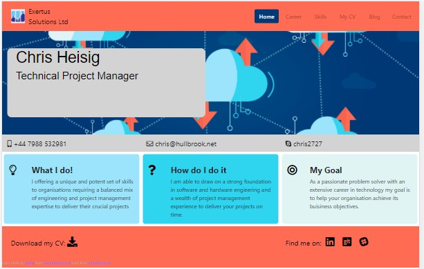{width=50%}

If the recruiter believes that he has a potential role match for me, the web site permits him to get in contact with me and request further information.

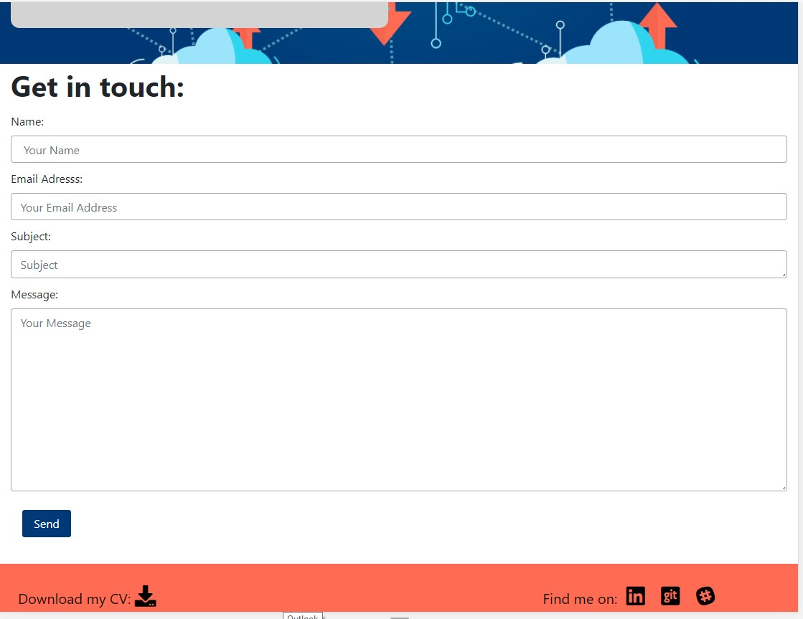{width=50%}

**Use case 2:** 

**Description:** Confirm that an employer can obtain sufficient background on Chris Heisig to know  that he is potentially suitable for the job.

**Method:** View the core skills and  career history pages using Google Developer Tools

**Expected Outcome:** A recruiter is able to determine the right level of information from my career history.

**Tested Outcome:** 

The website lists my core skills and career history.

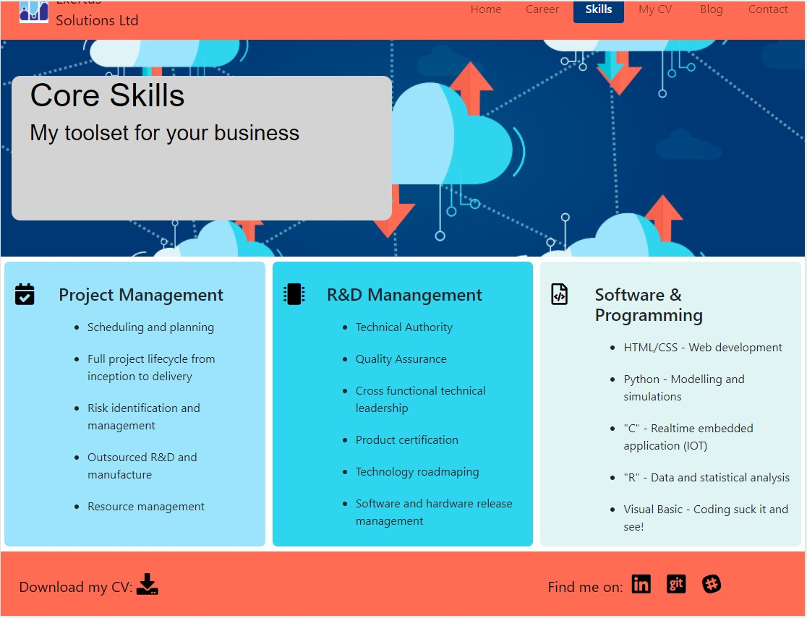{width=50%}

**Use case 3:**

**Tested Outcome** Not testable at this stage.

**Use case 4:** 

**Description** Lead the web site visitor to read my blog.

**Method:** View my blog page using Google Developer Tools.

**Expected Outcome:** Visitors to my web site will be interested to see what I get up to.

**Tested Outcome:** 
My website includes a page dedicated to "things" that I have an interest in and how I have pursued them.

{width=25%}

**Use case 5:** 
 
**Description** View my web site on devices with different screen widths and confirm that it is readable.
 
**Method:** View my website using Google Developer Tools.

**Expected Outcome** The website contents is clearly readable on devices with different screen widths.
 
As the screen width is decreased, the columns aligned into a single row while still retaining the underlying form and structure. With further screen width reductions (320px) icons and images are hidden. 

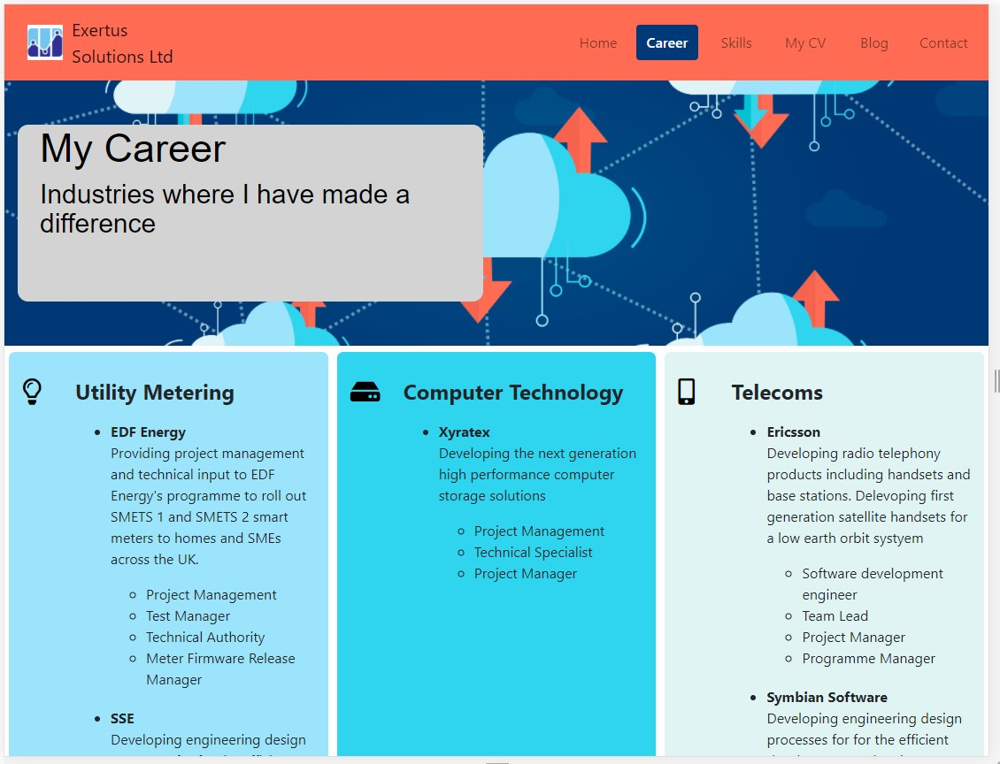{width=50%} 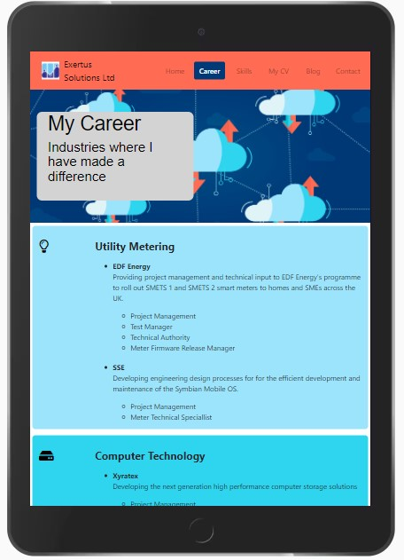{width=25%}    {width=15%}

*fig: Career page at 1206px,  Career page at 768px,  Career page at 320px*

The navigation bar colapses into an icon at the lowest screen width to save space for more content to be displayed.

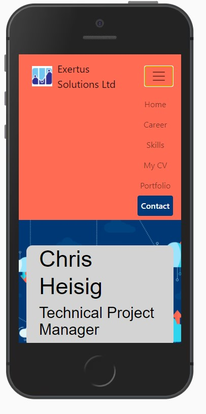{width=20%}

*fig: Collapsed nav bar at small screen width*

## 5. Non-functional Test

Confirm non-functional requirements identified in section 4 of the readme document.

**Test case 4.1**

**Description:** HTML code is compliant.

**Method:** Run all pages through the W3C validator.

**Expected Outcome:** No errors identified.

**Tested Outcome**  Pass -code errors and warning rectified and commited to Git.

**Test case 4.2**

**Description:** CSS code is compliant.

**Method:** Run all pages through the W3C validator.

**Expected Outcome:** No errors identified.

**Tested Outcome**  Three parse errors encountered which would suggest some hidden characters in the CSS file - not considered serious.

**Test Case 4.3**

**Description:** Confirm a web page typical browser load time.

**Method:** Use Google Chrome Development Tools to analyse the loading of the career.html file.

**Expected Outcome:** Efficiently stuctured web pages should load in less than one second 

**Tested Outcome:**  

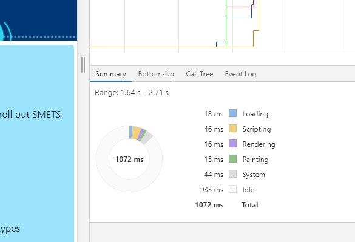{width=20%}

*fig: Not bad total load time - could be better!*

## 6. Functional Test

Confirms functional requirements set out in section 3 found in the readme.md document.

**Test Case 3.4.1**
 
**Description:** Use the navigation bar items to navigate between web pages.

**Method:** Inspect a page using the Google Browser Development Tools.

**Expected Outcome:** The user is able to navigate between pages using the navigation bar items.
 
**Tested Outcome:** 

{width=20%}  {width=50%}

*fig: showing navigation bar item selected*

**Test Case 3.4.2**

**Description:** Reduce the screen width to  320px and demonstrate that the navigation bar collapses to an icon.

**Method:** Inspect a page using the Google Browser Development Tools.

**Expected Outcome:** The user is able to navigate between pages using the navigation bar items when expanded on a 320px screen.
 
**Tested Outcome:** 

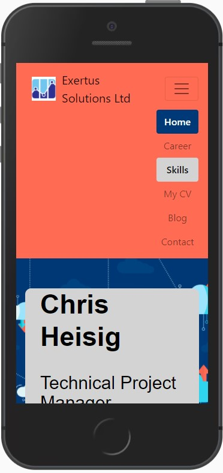{width=20%}

*fig: showing navigation bar expanded from the icon*

**Test Case 3.4.3**

**Description:** Click on the collapsed navigation bar icon at a screen width of 320px to reveal the navigation bar with items vertically aligned.

**Method:** Inspect a page using the Google Browser Development Tools.

**Expected Outcome:** For a 320px screen size the navigation bar is displayed vertically.
 
**Tested Outcome:** 

{width=20%}

*fig: showing navigation bar displayed vertically*

**Test case 3.4.4**

**Description:** Observe the navigation bar and confirm that an item responds to being selected (clicked on).
 
**Method:** Inspect a page using the Google Browser Development Tools.

**Expected Outcome:** For any size screen, a navigation bar item will respond positively to being selected.
 
**Tested Outcome:** 

{width=30%} {width=30%}

*fig: showing navigation bar response to selection*

**Test Case 3.4.5** 

**Description:**  Hover over a navigation bar item and  #confirm that it responds by changing colour.

**Method:** Inspect a page using the Google Browser Development Tools.

**Expected Outcome:** For any size screen, a navigation bar item will respond positively to being hovered over.
 
**Tested Outcome:** 

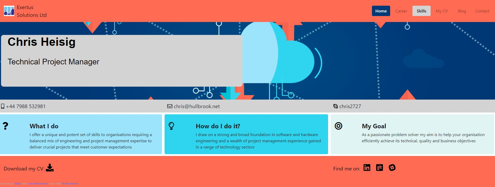{width=50%} {width=25%}

*fig: showing response to hovering over a navigation bar item*

**Test Case 3.4.6**

**Description:** Confirm that with the exception of the page leading to the CV, all pages will display the same header and footer.

**Method:** Inspect a page using the Google Browser Development Tools.

**Expected Outcome:** The same header and footer is displayed on all pages except for the one assocaited with the CV.
 
**Tested Outcome:** 

{width=30%} {width=50%}

*fig: showing header and footer content and location*

**Test Case 3.4.7**

**Description:** Confirm that the user is able to navigate back to the home page.

**Method:** Inspect a page using the Google Browser Development Tools.

**Expected Outcome:** The visitor is able to navigate back to the home page.  

**Tested Outcome:**

{width=30%}

*fig: Navigation from the Contact Page back to the Home page with the cursor hovering above the Home navigation bar item*

**Test Case 3.4.8**

**Description:** Confirm that with the exception of the page leading to the CV, all pages will display the same central banner in the same position.

**Method:** Inspect a page using the Google Browser Development Tools.

**Expected Outcome:** All pages with the exception of the page leading the CV display the same central banner.

**Tested Outcome:**

{width=30%} {width=30%} {width=30%} 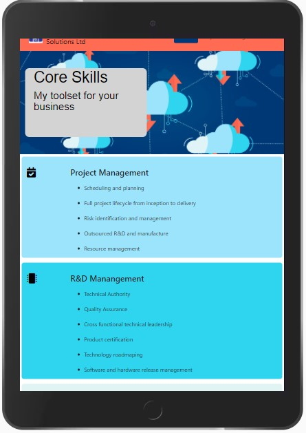{width=30%}
{width=30%}

*fig: Central banner appears in the same location on each page*

**Test Case 3.4.9**

**Description:** Confirm that clicking on icons located in either the header or footer results in a successful hyperlink to the selected web site. 

**Method:** Use Google Browser to confirm the landing page.

**Expected Outcome:** Clicking on an icon in the header or footer results in a hyperlink to the selected site.

**Tested Outcome:**
Test passed - it is not possible to provide a screen shot of this activity.

**Test Case 3.4.10**

**Description:** Confirm that when using the contact page for sending me a message, that unless all the fields have been entered, it will not be possible to submit the message. 

**Method:** Inspect the contact page using the Google Browser Development Tools.

**Expected Outcome:** The submit button will not respond and a message will be displayed asking the visitor to complete the next field.

**Tested Outcome:**

{width=50%}

*fig: Contact page message not sent*

**Test Case 3.4.11**

**Description:** Confirm that when using the contact page for sending me a message and all fields have been correctly entered, a positive respose is sent to the visitor.

**Method:** Inspect the contact page using the Google Browser Development Tools.

**Expected Outcome:** The submit button will respond and a notification will be displayed confirming that the message has been sent and allowing the visitor to return back to the contact page.

**Tested Outcome:**

{width=40%} {width=40%} {width=40%}

*fig: Contact page - message sent sucessfully response and return to main web site*

**Test Case 3.5.1**

**Description:** Confirm that all pages render correctly at screen widths of 320px for phones, 768px for tablets, 1206px for desk tops. 

**Method:** Verify correct rendering using Google Browser Development Tools and setting the screen width to the appropriate number of pixels to emulate the given device.

**Expected Outcome:** For all pages, the  content is readable at the three screen widths of 1206px, 768px and 320px.
 
**Tested Outcome:** 

{width=50%} {width=25%} 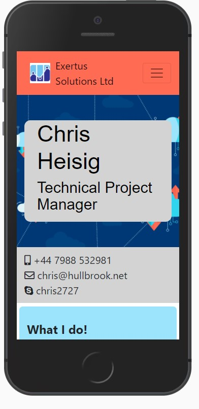{width=15%}

*fig: Index page at 1206px,*  *Index page at 768px,* *Index page at 320px*

**Test Case 3.5.2**

**Description:** Confirm that a  limited pallet of colours (less than 7) has been used.

**Method** Inspect the associated CSS file.

**Expected Outcome:** A pallet of less than 7 colours has been used.

**Tested Outcome:** Pages use the colour pallet specified in the CSS file.

**Test Case 3.5.3**

**Description:** Confirm that the "rule of three has been used in the design where this renders a readable image.

**Method:** Inspect a page using the Google Browser Development Tools

**Expected Outcome:** The "rule of three" is being utilised.

**Tested Outcome** 

{width=50%}

*fig: Index page at 1206px,*

### Test Case 3.5.4

**Description:** Confirm that page content is stacked at a 768px screen size.

**Method:** Inspect a page using the Google Browser Development Tools

**Expected Outcome:** Content is stacked when viewed at a screen size of 768px.

**Tested Outcome** 

{width=30%}

*fig Career page at 768px*

### Test Case 3.5.5

**Description:** Confirm that page content is stacked at a 320px screen size and icons are hidden.

**Method:** Inspect a page using the Google Browser Development Tools

**Expected Outcome:** The content is stacked and icons hidden when viewed at a screen size of 320px.

**Tested Outcome** 

{width=15%}

*fig Career page at 320px*

**Description:** For 320px screen widths the navigation bar is rendered as a icon and expands out when clicked.

**Method:** Verify that the Navigation bar icon expands to reveal it's contents in a vertical list and that it is possible to navigate to another page.

**Expected Outcome:** Navigation bar icon expands out  to reveal it's contents in a vertical list and that it is possible to navigate to another web page.

**Tested Outcome:** 

 {width=16%} {width=15%}
 
 *fig Nav icon expands at a screen width of  320px*
 
 

